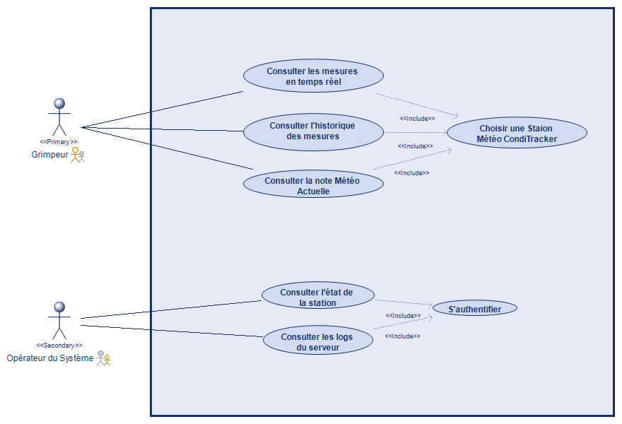
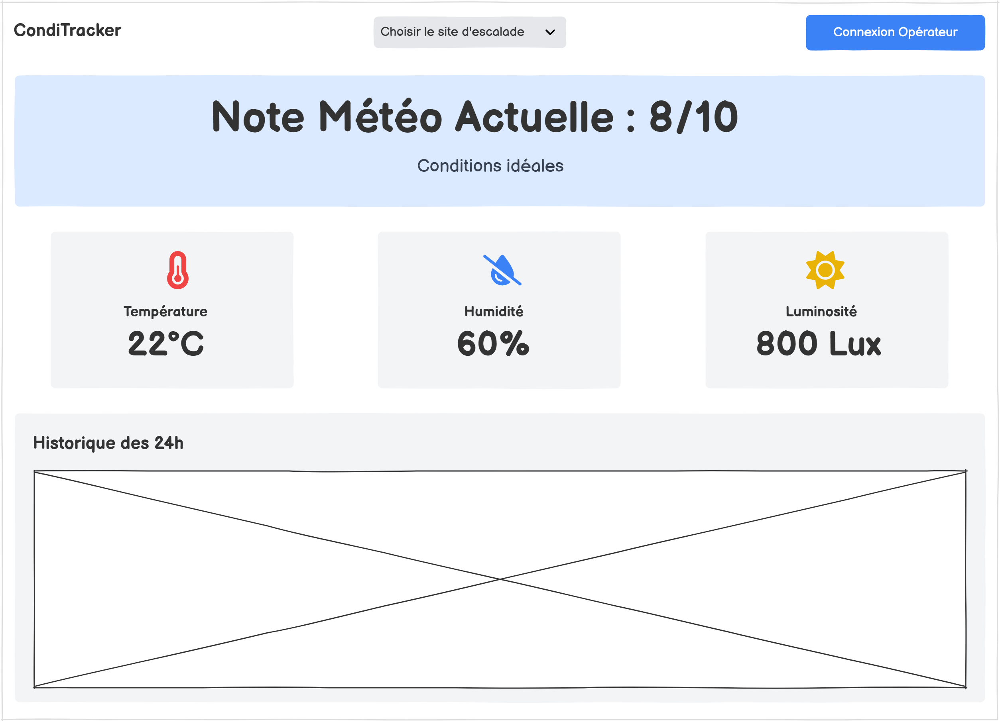

# Cahier des Charges (Dossier d'analyse et de Conception)

## Historique des Versions

| Version | Date | Auteur | Description des Modifications |
| :--- | :--- | :--- | :--- |
| 1.0 | 15 nov. 2025 | Camille Lenoir | Création initiale du document |
| 1.1 | 22 nov. 2025 | Camille Lenoir | Complétion, analyse et conception UML |
| 1.2 | 24 nov. 2025 | Camille Lenoir | Mise à jour et Correction des Diagrammes |
| 1.3 | 2 déc. 2025 | Camille Lenoir | Dernière Relecture et Correction |

---

## 1. Introduction

Le présent document constitue le Cahier des Charges (CDC) pour le projet **CondiTracker**, une station météo connectée destinée à fournir en temps réel aux grimpeurs les conditions météorologiques précises d’un site naturel d’escalade.

Le document formalise les besoins, objectifs, contraintes ainsi que les aspects analytiques et conceptuels nécessaires au développement du système dans le cadre de la SAE.

## 2. Objectifs du Projet

### 2.1. Objectifs Généraux
L'objectif principal du projet est de concevoir un système complet permettant la collecte, la transmission, le stockage et la consultation de mesures météorologiques locales, afin d’aider les grimpeurs à identifier les conditions optimales de pratique.

### 2.2. Objectifs Spécifiques
* Développer une station météo prototype basée sur un microcontrôleur Arduino.
* Concevoir une architecture serveur capable de recevoir, valider et stocker les mesures.
* Mettre en place une interface web intuitive afin de consulter les données en temps réel.
* Formaliser les besoins et modéliser le système (UML) dans le cadre de la SAE.
* Spécifier le protocole d’échange entre la station (Arduino) et le serveur Java.

## 3. Périmètre du Projet

Le périmètre concerne l’ensemble de la chaîne fonctionnelle allant du captage des données jusqu’à leur visualisation.

### 3.1. Fonctionnalités Incluses
* Acquisition de mesures météorologiques (température, humidité, luminosité…).
* Transmission des données vers un serveur Java via liaison série (prototype SAE).
* Persistance des mesures dans une base de données MySQL.
* Consultation des mesures actuelles et historiques via interface web.
* Authentification simple pour l’opérateur système.

### 3.2. Fonctionnalités Exclues
* Déploiement réel sur falaise (remplacé par un prototype simulé).
* Connexion LoRa, 4G ou panneaux solaires (hors périmètre mais envisagés en version réelle).
* Algorithmes d’analyse avancée (prédiction de séchage, recommandations complexes).

### 3.3. Utilisateurs Ciblés
* **Grimpeurs / visiteurs** : consultation des données.
* **Acteurs Régionaux** : FFME / Ouvreurs Locaux.

## 4. Analyse de l'Existant

Les grimpeurs se basent principalement sur des applications météo généralistes qui ne prennent pas en compte les conditions spécifiques d’une falaise, notamment l’orientation, le vent local, l’humidité résiduelle de la roche ou l’ensoleillement réel.

Aucun système local et accessible au public ne fournit actuellement ces données en temps réel. Le projet CondiTracker répond à ce manque en proposant une solution IoT simple mais extensible.

## 5. Besoins et Exigences

### 5.1. Exigences Fonctionnelles (EF)
Ce sont les fonctionnalités que le système doit fournir.

| Réf. | Description | Priorité |
| :--- | :--- | :--- |
| **EF-01** | La station doit mesurer la température, l’humidité et la luminosité. | Élevée |
| **EF-02** | La station doit transmettre les données périodiquement au serveur via liaison série. | Élevée |
| **EF-03** | La station doit pouvoir recevoir des requêtes du serveur et répondre avec les données. | Élevée |
| **EF-04** | Le serveur Java doit analyser, convertir, valider et enregistrer les mesures. | Élevée |
| **EF-05** | L’interface web doit permettre de consulter les données en temps réel. | Élevée |
| **EF-06** | L’opérateur doit pouvoir s’authentifier pour accéder à la supervision. | Moyenne |
| **EF-07** | Le système doit notifier l’opérateur en cas d’erreur de transmission. | Faible |

### 5.2. Exigences Non Fonctionnelles (ENF)
Ce sont les critères de performance et les contraintes.

#### 5.2.1. Performance
* Temps de réponse maximal de 5 secondes pour l’affichage des mesures récentes.
* Capacité de supporter 20 utilisateurs simultanés.

#### 5.2.2. Sécurité
* Authentification des opérateurs par mot de passe.
* Validation stricte du format des messages entrants.

#### 5.2.3. Ergonomie et Utilisabilité
* Interface web simple, lisible et optimisée pour ordinateur.

#### 5.2.4. Contraintes Techniques et Environnement
* **Microcontrôleur** : Arduino Uno.
* **Serveur métier** : Java (liaison série + API interne).
* **Base de données** : MySQL / MariaDB.
* **Hébergement** : WampServer (PC local).
* **Communication** : liaison série USB (prototype).

## 6. Architecture Fonctionnelle et Technique

### 6.1. Architecture Fonctionnelle
Le système se compose de quatre modules principaux :
* **Module Captation** : capteurs connectés à Arduino.
* **Module Transmission** : envoi des mesures vers le serveur.
* **Module Serveur Métier** : traitement, validation, stockage.
* **Module Interface Web** : consultation utilisateur.

### 6.2. Architecture Technique
* **Niveau Capteur** : Arduino Uno + Capteurs (Température/Humidité/Luminosité). Communique en Série (USB).
* **Niveau Acquisition** : Serveur Java. Il écoute le port série, parse les données et les insère dans la BDD.
* **Niveau Données** : Base de données MySQL (WampServer). Stocke les mesures et les utilisateurs.
* **Niveau Web** : Interface Client communiquant avec une API REST interne développée en PHP (hébergée sur WampServer) pour lire les données.

#### Évolutions identifiées pour la version finale :
* **Sécurisation de l'accès** : Remplacer l'accès direct actuel par une authentification forte (Login/Mot de passe) afin de protéger les données techniques et l'administration du serveur.
* **Visualisation graphique** : Ajouter un mode de vue "Graphique" pour permettre aux grimpeurs d'analyser visuellement les tendances (baisse de température, séchage) sur les dernières 24h.
* **Système d'alertes intelligent** : Rendre le système proactif en envoyant une notification (Email ou SMS) à l'utilisateur dès que la "Note Météo" dépasse un seuil de qualité personnalisé (ex: note > 8/10).

### 6.3. Prototypage des IHM

**Navigation et Sélection de Station :**
L’interface utilisateur a été conçue pour offrir un accès immédiat à l’information critique. L'interaction principale repose sur un **menu déroulant** situé dans le bandeau supérieur, permettant au grimpeur de sélectionner intuitivement le site d'escalade (la station) souhaité.
Dès la validation du choix, l'interface déclenche une mise à jour dynamique de l'ensemble du tableau de bord :
* Affichage de la **Note Météo** et des conditions en temps réel (Température, Humidité, Luminosité).
* Chargement simultané de l'**historique des mesures** sur les dernières 24h, permettant d'analyser l'évolution récente des conditions.

**Espace Opérateur - Supervision :**
L'accès à l'administration se fait via le bouton "Connexion Opérateur", ouvrant instantanément un tableau de bord de supervision dédié à la maintenance technique. Cette interface centralise deux outils essentiels pour l'exploitant :
* **État du Parc** : Une vue synthétique de la santé des stations (statut "En ligne", mode de fonctionnement, dernier contact), permettant de détecter immédiatement une panne.
* **Journal des Logs** : Un flux d'activité détaillé remontant les événements techniques (erreurs de capteurs, tentatives de connexion) pour faciliter le diagnostic et le débogage à distance.

### 6.4. Spécification du Protocole de Communication

La communication entre la station météo (Arduino) et le Serveur Métier (Java) s'effectue via une liaison série. Le protocole est textuel, basé sur des balises délimitées par `<` et `>`, assurant la lisibilité et le débogage.

#### 6.4.1. Format Général
Toutes les trames respectent la structure : `<TYPE;ID:xx;PAYLOAD>`
* **TYPE** : Type de message (SYN, ACK, NACK, REQ, REP).
* **ID** : Identifiant unique de la station (ex: 01).
* **PAYLOAD** : Données ou paramètres (optionnel).

#### 6.4.2. Phase d'initialisation (Handshake)
Avant toute mesure, la station doit s'identifier et vérifier son intégrité.
* Station → Serveur : `<SYN;ID:01;STA:UP>` (Demande de synchronisation, état OK).
* Station → Serveur (Erreur) : `<SYN;ID:01;STA:ERR_DHT>` (Si un capteur est HS au démarrage).

#### 6.4.3. Modes de Fonctionnement (Configuration)
Le serveur répond à la synchronisation en imposant le mode de fonctionnement :

* **Mode PUSH (Automatique)** : La station envoie les données périodiquement.
    * Commande Serveur : `<ACK;ID:01;MODE:Push;FREQ:3600000>` (Fréquence en ms).
* **Mode PULL (Guidé/Polling)** : La station attend une requête pour mesurer.
    * Commande Serveur : `<ACK;ID:01;MODE:Pull>`
* **Refus/Erreur** : Si l'ID est inconnu.
    * Commande Serveur : `<NACK;ID:01>`

#### 6.4.4. Échange de Données (Acquisition)
* Requête Serveur (Mode Pull uniquement) : `<REQ;ID:01>`
* Réponse Station (Mesure nominale) : `<REP;ID:01;TEMP:20.5;HUM:64;LUM:800;PLU:0>`
* Réponse Station (Erreur capteur pendant fonctionnement) : `<REP;ID:01;STA:ERR_DHT>`

## 7. Livrables Attendus

Les livrables de ce projet comprennent :
1.  **Livrable 1** : Vidéo de présentation de CondiTracker.
2.  **Livrable 2** : Dossier d’analyse et de conception (Cdc).
3.  **Livrable 3** : Dossier Code Source du Projet (Java / Arduino / Web / Annexes).
4.  **Livrable 4** : Vidéo finale du système.

## 8. Calendrier (Échéancier)

| Phase | Jalon | Date de Début | Date de Fin |
| :--- | :--- | :--- | :--- |
| Recherche / Analyse | Phase de recherche de projet | 6 oct. 2025 | 24 oct. 2025 |
| Analyse / Cadrage | Vidéo de Présentation (Livrable 1) | 25 oct. 2025 | 7 nov. 2025 |
| Analyse / Conception | Dossier d’analyse et de conception (Livrable 2) | 8 nov. 2025 | 23 nov. 2025 |
| Développement | Programmation Arduino | 24 nov. 2025 | 30 nov. 2025 |
| Développement | Serveur Java & Base MySQL | 1 déc. 2025 | 14 déc. 2025 |
| Développement | Interface Web | 15 déc. 2025 | 21 déc. 2025 |
| Test / Validation | Tests Unitaires / Tests d’intégration / Correctifs | 22 déc. 2025 | 28 déc. 2025 |
| Validation | Dossier Code Source du Projet (Livrable 3) | 28 déc. 2025 | 5 janv. 2026 |
| Présentation | Vidéo final du système (Livrable 4) | 5 janv. 2026 | 9 janv. 2026 |

## 9. Budget / Matériel

| Matériel | Coût |
| :--- | :--- |
| Arduino UNO | Prêt IUT de Valence |
| Boîte Adeept Ultimate Starter Kit Arduino | Prêt IUT de Valence |
| Capteur de T° et d'humidité DHT11 | Inclus dans la Boîte Adeept |
| Capteur de Luminosité | Inclus dans la Boîte Adeept |
| Ordinateur Personnel | - |
| **Total** | **~0€** |